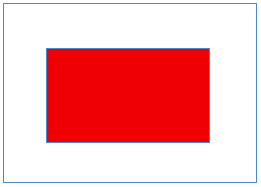
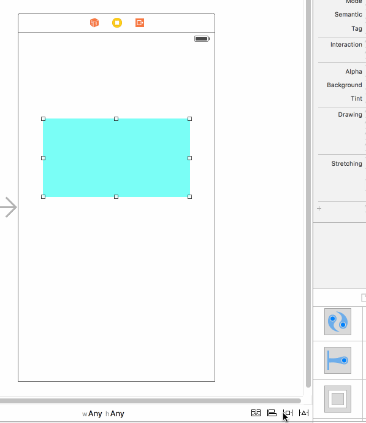

#Autolayout
iphone早期屏幕尺寸单一，因而屏幕适配的问题不用过多考虑。随着iphone的发展，苹果也适时的推出了Autoresizing技术，解决了父子控件的适配问题。iphone发展到现在屏幕尺寸越来越多，屏幕适配不再是安卓的专利，因此苹果推出了更加强大的Autolayout技术，解决了父子控件的适配问题。Autolayout在这里主要介绍其应用方法，所以通过几个具体的适配来熟悉这一技术。

#####1.适配实例1
要求：在控制器的view上创建一个红色的view，红色的view距离控制器view上左下右的距离保持为50.

操作过程：

constrain to margins为左右两边保留20点的距离。顶部默认以状态栏(Top Layout Guide)底部为0点。

注意事项：
1）当约束不足或约束错误的时候

#####2.适配实例2
要求：修改适配1中红色view距离控制器view左右的距离分别为30、80。

