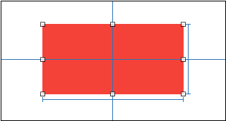
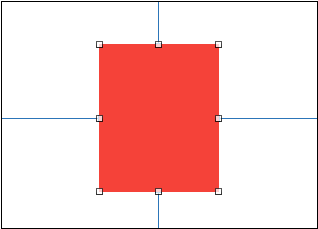
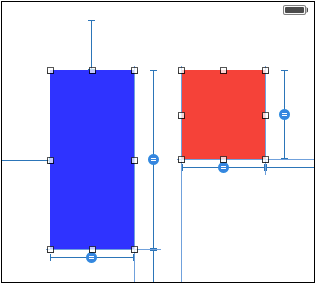

#Masonry的简单使用
有时候我们需要用代码设置约束，而苹果爸爸的NSLayoutConstraint看着实在让人恶心，简洁优雅的Masonry才是我们所爱，在这通过一些实例来了解Masonry如何进行布局。

#####1. Masonry约束常用方法
- mas_makeConstraints

 添加新的约束，每添加一次就添加一个约束
```objc
 - (NSArray *)mas_makeConstraints:(void(^)(MASConstraintMaker *make))block;
```
- mas_remakeConstraints

 删除之前的约束重新添加约束
```objc
 - (NSArray *)mas_remakeConstraints:(void(^)(MASConstraintMaker *make))block;
```
- mas_updateConstraints

 修改之前的某些特定约束
```objc
 - (NSArray *)mas_updateConstraints:(void(^)(MASConstraintMaker *make))block;
```

#####2. Masonry约束的类型
- 尺寸：width\height\size
- 边界：left\leading\right\trailing\top\bottom
- 中心点：center\centerX\centerY
- 边界：edges


#####3. Masonry约束实例
**1）实例1：**
要求：在控制器的view上创建一个红色的view，红色的view的中心和控制器view的中心重合且红色view宽高分别为200、100。

<div align="center">

</div>

```objc
- (void)viewDidLoad {
    [super viewDidLoad];
    UIView *redView = [[UIView alloc]init];
    redView.backgroundColor = [UIColor redColor];
    [self.view addSubview:redView];
 
    [redView mas_makeConstraints:^(MASConstraintMaker *make) {
        //mas_equalTo不用包装参数为对象 
        make.width.mas_equalTo(200);
        make.height.equalTo(@100);
        //equalTo参数如果省略约束类型则默认和左边需要约束的类型相同
        make.center.equalTo(self.view);
    }];
}
```

**2）实例2：**
要求：在控制器的view上创建一个红色的view，红色view上下距离控制器view都为200，红色view左右距离控制器view都为100。
<div align="center">

</div>


```objc
    [redView mas_makeConstraints:^(MASConstraintMaker *make) {
        make.top.equalTo(self.view).offset(200);
        make.bottom.equalTo(self.view).offset(-200);
        make.left.equalTo(self.view).offset(100);
        //右边的参数都有前缀mas_
        make.right.equalTo(self.view.mas_right).offset(100);
        // 或者用edges
        //make.edges.equalTo(self.view).insets(UIEdgeInsetsMake(200, 100, 200, 100));
    }];

```
**3）实例3：**
要求：在控制器view底部添加2个view，1个蓝色，1个红色
，2个view宽度相等，红色view的高度等于蓝色view高度的一半，两个view距离父控件左边、右边、下边间距和他们之间的间距都为50。
<div align="center">

</div>


```objc

- (void)viewDidLoad {
    [super viewDidLoad];
    UIView *redView = [[UIView alloc]init];
    redView.backgroundColor = [UIColor redColor];
    [self.view addSubview:redView];
    
    UIView *blueView = [[UIView alloc]init];
    blueView.backgroundColor = [UIColor blueColor];
    [self.view addSubview:blueView];
    
    [blueView mas_makeConstraints:^(MASConstraintMaker *make) {
      
        make.top.equalTo(self.view).offset(50);
        make.bottom.equalTo(self.view).offset(-50);
        make.left.equalTo(self.view).offset(50);
        make.right.equalTo(redView.mas_left).offset(-50);
        make.width.equalTo(redView);
    }];
 
    [redView mas_makeConstraints:^(MASConstraintMaker *make) {
        make.top.equalTo(self.view).offset(50);
        make.right.equalTo(self.view).offset(-50);
        make.height.equalTo(blueView).multipliedBy(0.5);

    }];
}
```


#####4.Masonry Tips
- 定义宏MAS_SHORTHAND、MAS_SHORTHAND_GLOBALS

 在masonry头文件前定义MAS_SHORTHAND、MAS_SHORTHAND_GLOBALS宏后在进行约束时就不需要再输入mas_前缀了。
 
- equalTo里的约束参数需带前缀mas_
如下：self.view.left != self.view.mas_left
```objc
make.left.equalTo(self.view.left) != make.left.equalTo(self.view.mas_left);
```

- 约束参数如果类型省略则默认与左边需要约束的类型相同
如下：self.view == self.view.mas_left
```objc
make.left.equalTo(self.view) == make.left.equalTo(self.view.mas_left);
```

- 省略equalTo默认为与其父类的约束
如下：
```objc
make.top.offset(50) = make.top.equalTo(superView).offset(50);
```