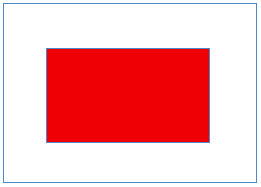

#Masonry的简单使用
有时候我们需要用代码设置约束，而苹果爸爸的NSLayoutConstraint看着实在让人恶心，简洁优雅的Masonry才是我们所爱，在这通过一些实例来了解Masonry如何进行布局。

#####1.Masonry约束常用方法
- mas_makeConstraints

 添加新的约束，每添加一次就添加一个约束
```objc
 - (NSArray *)mas_makeConstraints:(void(^)(MASConstraintMaker *make))block;
```
- mas_remakeConstraints

 删除之前的约束重新添加约束
```objc
 - (NSArray *)mas_remakeConstraints:(void(^)(MASConstraintMaker *make))block;
```
- mas_updateConstraints

 修改之前的某些特定约束
```objc
 - (NSArray *)mas_updateConstraints:(void(^)(MASConstraintMaker *make))block;
```

#####2.Masonry约束实例
要求：在控制器的view上创建一个红色的view，红色的view的中心和控制器view的中心且红色view宽高分别为200、100。
<div align="center">

</div>

```objc
- (void)viewDidLoad {
    [super viewDidLoad];
    UIView *redView = [[UIView alloc]init];
    redView.backgroundColor = [UIColor redColor];
    [self.view addSubview:redView];
 
    [redView mas_makeConstraints:^(MASConstraintMaker *make) {
        make.width.equalTo(@200);
        make.height.equalTo(@100);
        //参数如省略约束类型则默认和左边需要约束的类型相同
        make.center.equalTo(self.view);
    }];
}
```