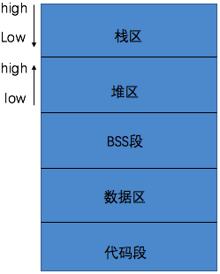

#iOS中的堆栈区

程序在系统中运行所需要的空间并不是统一的，而是在内存中不同的区域，不同区域对内存空间的管理是不同的，因而需要明确不同数据各自的内存管理方式。

####1.程序执行基本流程
- 操作系统将物理硬盘代码载入到内存
- 操作系统把代码分配到不同的区域
- 操作系统找到main函数执行程序

####2.内存区域
iOS中系统内存区域主要分为以下五个区域，栈区、堆区、BSS段、数据区以及代码段，见下图。

- 栈区

    由系统分配内存并对内存进行管理，是一种先进后出向低地址扩展的数据结构，也就是说栈顶的地址和栈的最大容量是由系统预先设定好了的（1M或2M），是一块连续的内存区域，用于存储局部变量。iOS中的基本数据类型，如int、float、struct等类型的局部变量都是存放在栈区。
  
 - 栈区特点：
 
    优点：快速高效，开发人员无需关注其内存的释放；
 
    缺点：数据有限制且不够灵活(数据大小与生存期必须是确定的)。
 
 - 栈空间分配方式：
 
    静态分配：由编译器完成，比如auto类型变量的分配；
  
    动态分配：由alloc完成，与堆区的动态分配不同仍由系统自动管理。

- 堆区 

    是一种先进先出向高地址扩展的数据机构，是一块不连续的数据区域。堆最大可达计算机虚拟内存的大小。由开发者进行空间的申请和释放，如不进行释放会造成内存泄漏，程序结束后可能由操作系统回收。iOS中通过引用计数对对象的生命周期进行管理。
  
 - 堆区特点：

    优点：获得空间灵活，分配内存较大；
  
    缺点：容易造成碎片(试想在1-4、7-10都申请了内存，而我要申请8字节的大小的      
         内存其中5-8的内存相对来说就成了碎片，只得到其他地址申请4字节的内  
         存)，效率降低。
         
 - 堆空间分配方式：
 
    动态分配：由alloc分配内存，速度较慢。
    
- BSS段

    和数据区相邻的一块区域，没有初始化的全局变量和静态变量存储在这个区域，程序退出后释放。
 
- 数据区

    用于存储已经初始化的全局变量和静态变量以及字符串常量，程序退出后释放。
 
- 代码段

    用于存放已经编译后的二进制代码，每一个指令，每一个单个函数、过程、方法和执行代码都存在这个内存段中直到应用程序退出。
    

PS: I am xinghun who is on the road.
