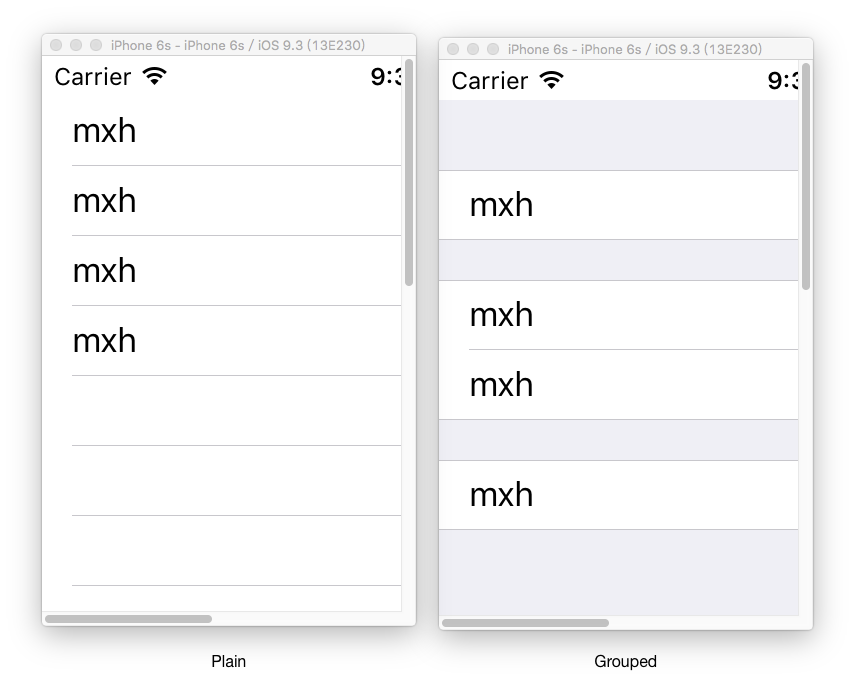
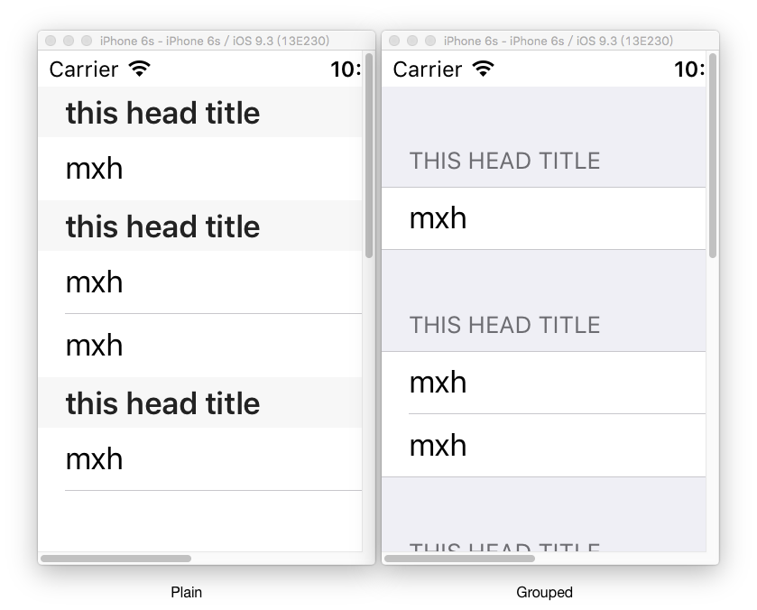
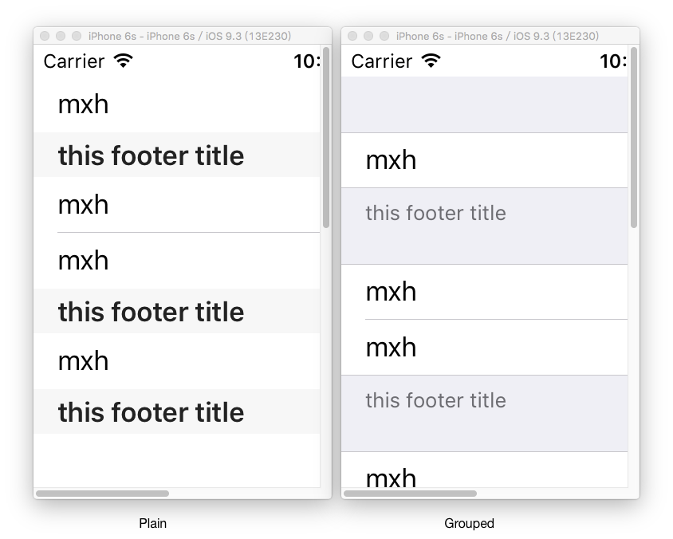
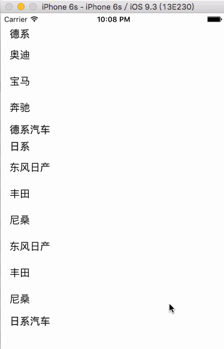
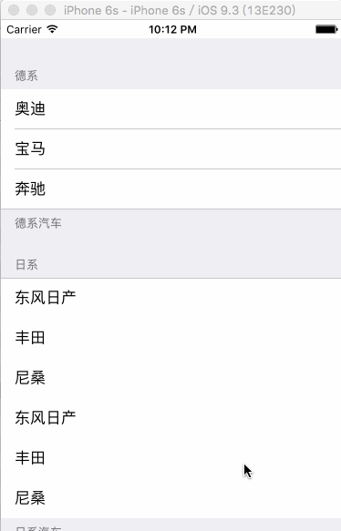

#UITableView
在iOS开发中UITableView可以说是一个最为核心且应用广泛的控件，包括QQ、微信、微博等无数应用都能见到它的身影。于此同时UITableView的用法也相对复杂，出现的问题也较多，所以在这里将UITableView的一些常用方法和问题作一个分析总结。

####1.数据源
UITableView要显示数据，那它要知道显示多少数据，显示什么数据，以什么样的方式呈现。这一点UITableView的数据源DataSource为我们考虑到了，当一个对象想成为数据源就必须遵守UITableView的数据源协议UITableViewDataSource并实现相应的协议方法。

**UITableViewDataSource协议方法：**
**@required**
- numberOfRowsInSection方法:
返回每一组的行数，有多少组就调用多少次

 ```objc
 - (NSInteger)tableView:(UITableView *)tableView numberOfRowsInSection:(NSInteger)section;
```

- cellForRowAtIndexPath方法:
返回cell，有多少个cell就调用多少次

 ```objc
  - (UITableViewCell *)tableView:(UITableView *)tableView cellForRowAtIndexPath:(NSIndexPath *)indexPath;
```

**@optional**
- numberOfSectionsInTableView方法:
返回组数，调用reloadData刷新数据时有多少组就调用多少次，如果不实现则默认为一组

 ```objc
 - (NSInteger)numberOfSectionsInTableView:(UITableView *)tableView; 
```
对于有多少组首先和tableview的style有关，tableview有两种style即Plain和Grouped如下图所示：Plain(普通类型)可以认为其组数为1，此时numberOfRowsInSection无效，当为Grouped(组类型)时有多少组就返回多少。

<div align="center">

</div>

- titleForHeaderInSection方法

 返回每一组的头部标题，如下图所示
 ```objc
 - (nullable NSString *)tableView:(UITableView *)tableView titleForHeaderInSection:(NSInteger)section {
      return @"this head title";
 }
```
<div align="center">

</div>


- titleForFooterInSection方法

 返回每一组的底部标题，如下图所示

  ```objc
  - (nullable NSString *)tableView:(UITableView *)tableView titleForFooterInSection:(NSInteger)section {
      return @"this footer title";
 }
```
<div align="center">

</div>

设置了头尾部标题的Plain样式的tableView在向上滑动时第一个头部标题不动直到第二个头部标题或尾部标题将它顶出tableview可视区域，如下图所示;
<div align="center">

</div>

如果tableview的样式为Grouped则没有Plain样式的滑动效果，如下图所示：

<div align="center">

</div>


####1.UITableView应用实例
**1）实例1**
要求：如下图，实现三组，其行数分别为2、5、1行的基本样式。
<div align="center">

</div>

```objc
@interface ViewController ()<UITableViewDataSource>
@property (weak, nonatomic) IBOutlet UITableView *tableVIew;
@end

@implementation ViewController

- (void)viewDidLoad {
    [super viewDidLoad];
    self.tableVIew.dataSource = self;

}

#pragma mark - UITableViewDataSource

- (NSInteger)numberOfSectionsInTableView:(UITableView *)tableView {
    return 3;
}
- (NSInteger)tableView:(UITableView *)tableView numberOfRowsInSection:(NSInteger)section {
    if (section == 0) {
        return 2;
    } else if (section == 1) {
        return 5;
    }
    return 1;
}

- (UITableViewCell *)tableView:(UITableView *)tableView cellForRowAtIndexPath:(NSIndexPath *)indexPath {
    UITableViewCell *cell = [[UITableViewCell alloc]init];
    cell.textLabel.text = @"mxh";
    return cell;
}

@end

```
