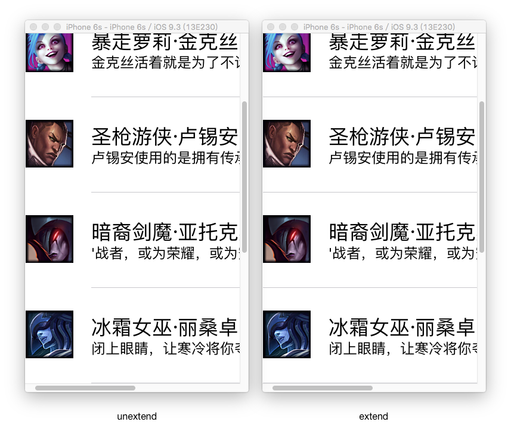

在iOS开发中UITableView可以说是一个最为核心且应用广泛的控件，包括QQ、微信、微博等无数应用都能见到它的身影。于此同时继承自UIScrollView的UITableView用法也相对复杂，出现的问题也较多，所以在这里将UITableView的一些常用方法和问题作一个分析总结。

####1.UITableViewDataSource-数据源
UITableView要显示数据，那它要知道显示多少数据，显示什么数据，以什么样的方式呈现。这一点UITableView的数据源DataSource为我们考虑到了，当一个对象想成为数据源就必须遵守UITableView的数据源协议UITableViewDataSource并实现相应的协议方法。
**@required**
- numberOfRowsInSection方法:
返回每一组的行数，有多少组就调用多少次

 ```objc
 - (NSInteger)tableView:(UITableView *)tableView numberOfRowsInSection:(NSInteger)section;
```

- cellForRowAtIndexPath方法:  
返回cell，有多少个cell就调用多少次

 ```objc
 - (UITableViewCell *)tableView:(UITableView *)tableView cellForRowAtIndexPath:(NSIndexPath *)indexPath {
    //如果用UITableViewController则可以在IB上设置重用标识   
    static NSString *ID = @"mainCell";
    //离开tableview可视范围的cell被丢入缓存池，当需要创建cell的时候根据Cell标识从缓存池中取cell,从而避免了不停创建新的cell消耗内存。
    UITableViewCell *cell = [tableView dequeueReusableCellWithIdentifier:ID];
    if (!cell) {
        //如果用UITableViewController则可以在IB上设置cell模板
        cell = [[UITableViewCell alloc]initWithStyle:UITableViewCellStyleDefault reuseIdentifier:ID];
    }
    
    Hero *hero = self.data[indexPath.row];
    //cell的textLabel、imageView等子控件其实都在cell.contentView里
    cell.textLabel.text = hero.name;
    cell.imageView.image = [UIImage imageNamed:hero.icon];
    return cell;
}
```

**@optional**
- numberOfSectionsInTableView方法:
返回组数，调用reloadData刷新数据时有多少组就调用多少次，如果不实现则默认为一组

 ```objc
 - (NSInteger)numberOfSectionsInTableView:(UITableView *)tableView; 
```
对于有多少组首先和tableview的style有关，tableview有两种style即Plain和Grouped如下图所示：Plain(普通类型)可以认为其组数为1，此时numberOfRowsInSection无效，当为Grouped(组类型)时有多少组就返回多少。

<div align="center">

</div>

- titleForHeaderInSection方法

 返回每一组的头部标题，如下图所示
 ```objc
 - (nullable NSString *)tableView:(UITableView *)tableView titleForHeaderInSection:(NSInteger)section {
      return @"this head title";
 }
```
<div align="center">

</div>


- titleForFooterInSection方法

 返回每一组的底部标题，如下图所示

  ```objc
  - (nullable NSString *)tableView:(UITableView *)tableView titleForFooterInSection:(NSInteger)section {
      return @"this footer title";
 }
```
<div align="center">

</div>

  设置了头尾部标题的Plain样式的tableView在向上滑动时第一个头部标题不动直到第二个头部标题或尾部标题将它顶出tableview可视区域，如下图所示;
<div align="center">

</div>

如果tableview的样式为Grouped则没有Plain样式的滑动效果，如下图所示：

<div align="center">

</div>


####2.UITableViewDelegate-代理

- didSelectRowAtIndexPath方法:选中某个cell
```objc
 - (void)tableView:(UITableView *)tableView didSelectRowAtIndexPath:(NSIndexPath *)indexPath {
     //取消选中
    [tableView deselectRowAtIndexPath:indexPath animated:YES];
    NSLog(@"cell is selected");
}
```

- didDeselectRowAtIndexPath方法:取消选中某个cell
```objc
 - (void)tableView:(UITableView *)tableView didDeselectRowAtIndexPath:(NSIndexPath *)indexPath {
     NSLog(@"cell is deselected");
}
```

- heightForRowAtIndexPath方法:返回不同cell的高度
该方法在cellForRowAtIndexPath前调用，即先获取高度再创建cell。
```objc
 - (CGFloat)tableView:(UITableView *)tableView heightForRowAtIndexPath:(NSIndexPath *)indexPath {
    if (indexPath.row == 0) {
        return 50;
    }
    return 60;
    //1.如果没有返回估计高度，在heightForRowAtIndexPath方法内部通过[tableView cellForRowAtIndexPath:indexPath]方法创建cell则会调用heightForRowAtIndexPath方法造成死循环，如果返回了估计高度则过[tableView cellForRowAtIndexPath:indexPath]方法创建cell时不会再调用heightForRowAtIndexPath方法。
    /*
     XHStatusCell * cell = (XHStatusCell *)[tableView cellForRowAtIndexPath:indexPath];
     */
    
    //2.cell并未显示则cell内部的布局还未完成
    /*
    XHStatusCell * cell = [XHStatusCell cellWithTableView:tableView];
    cell.status = self.statusArr[indexPath.row];
     */
    
    //3.强制布局，每次获取高度都创建cell耗性能
    /*
    XHStatusCell * cell = [XHStatusCell cellWithTableView:tableView];
    cell.status = self.statusArr[indexPath.row];
    //强制布局
    [cell layoutIfNeeded];
    return cell.height;
    */
    
    //4.4.返回估计高度后，在调用heightForRowAtIndexPath时cell已经在cellForRowAtIndexPath方法中创建了cell，因此可以在cellForRowAtIndexPath方法中获取cell高度并存在字典self.height中
     return [self.height[@(indexPath.row)] doubleValue];
}
```
- estimatedHeightForRowAtIndexPath方法：返回每一行的估计高度

只要返回了估计高度，就会先调用cellForRowAtIndexPath方法创建cell，再调用heightForRowAtIndexPath获取cell的真实高度，而且显示多少cell才会调用多少次heightForRowAtIndexPath方法(如果不返回估计高度则有多少cell就调用多少次heightForRowAtIndexPath方法)
 ```objc
 - (CGFloat)tableView:(UITableView *)tableView estimatedHeightForRowAtIndexPath:(NSIndexPath *)indexPath {
    return 100;
}
```

####3.UITableViewCell的一些设置

- cell取消选中的样式
```objc
    cell.selectionStyle = UITableViewCellSelectionStyleNone;
```

- cell选中的背景
```objc
  UIView *selectedBackgroundView = [[UIView alloc]init];
  selectedBackgroundView.backgroundColor = [UIColor redColor];
  cell.selectedBackgroundView = selectedBackgroundView;
```

- cell设置指示器
```objc
       cell.accessoryType = UITableViewCellAccessoryDisclosureIndicator;
       //cell.accessoryView = [[UISwitch alloc]init];
```


####4.UITableView的一些设置
- separator分割线颜色

```objc
self.tableView.separatorColor = [UIColor blueColor];

```


- separator分割线延伸设置
```objc
    self.tableView.separatorStyle = UITableViewCellSeparatorStyleNone;
```

- tableviewcell分割线延伸到边缘
ios7后cell分割线距离tableview左边缘有一定距离，可以通过以下方法将分割线延伸或者直接在IB上将Separator Inset左右距离都设置成0。

 ```objc
 - (void)viewDidLayoutSubviews {
    [super viewDidLayoutSubviews];
    if ([self.tableView respondsToSelector:@selector(setSeparatorInset:)]) {
         [self.tableView setSeparatorInset:UIEdgeInsetsZero];
    }
    if ([self.tableView respondsToSelector:@selector(setLayoutMargins:)]) {
        [self.tableView setLayoutMargins:UIEdgeInsetsZero];
    }
}
```
<div align="center">

</div>


- tableview cell高度设置
```objc
 //所有cell等高
 self.tableView.rowHeight = 80;
```

- tableview cell高度设置


####5.UITableView数据更新

- insertRowsAtIndexPaths方法：插入行
```objc
     //加入动画且手动刷新,insertRowsAtIndexPaths会调用数据方法numberOfRowsInSection(返回行数需和插入后的行数一致)等，只更新插入的row，性能较高。
    [self.tableView insertRowsAtIndexPaths:@[[NSIndexPath indexPathForRow:0 inSection:0]] withRowAnimation:UITableViewRowAnimationLeft];
```
- deleteRowsAtIndexPaths方法：删除行
```objc
 //加入删除动画且手动刷新,deleteRowsAtIndexPaths会调用数据源方法numberOfRowsInSection(返回行数需和删除后的行数一致)，但不会调用cellForRowAtIndexPath方法，性能较高。
    [self.tableView deleteRowsAtIndexPaths:@[[NSIndexPath indexPathForRow:0 inSection:0]] withRowAnimation:UITableViewRowAnimationLeft];
```
- reloadRowsAtIndexPaths方法：更新行
```objc
//   //加入动画且手动刷新,reloadRowsAtIndexPaths会调用数据源方法numberOfRowsInSection(返回行数需和删除后的行数一致)，只更新更改的row，不用全部刷新，性能较高。
   [self.tableView reloadRowsAtIndexPaths:@[[NSIndexPath indexPathForRow:3 inSection:0]] withRowAnimation:UITableViewRowAnimationLeft];
```


####6.UITableView常见功能
1）编辑模式
 ```objc
    
//左滑删除，添加该方法后cell左滑就会出现删除按钮
(如果editingStyleForRowAtIndexPath方法返回的不是UITableViewCellEditingStyleDelete删除模式则不出现删除按钮)，
用户点击了删除(或添加)就调用该方法
 - (void)tableView:(UITableView *)tableView commitEditingStyle:(UITableViewCellEditingStyle)editingStyle forRowAtIndexPath:(NSIndexPath *)indexPath {
     if (editingStyle == UITableViewCellEditingStyleInsert) {//点击加号，插入行
        NSLog(@"insert");
    } else if (editingStyle == UITableViewCellEditingStyleDelete) {
        //删除模型
        [self.statusArr removeObjectAtIndex:indexPath.row];
        //刷新表格
        [self.tableView deleteRowsAtIndexPaths:@[indexPath] withRowAnimation:UITableViewRowAnimationLeft];
    }
    
}

//设置cell编辑模式为什么模式(删除或添加)
- (UITableViewCellEditingStyle)tableView:(UITableView *)tableView editingStyleForRowAtIndexPath:(NSIndexPath *)indexPath {
    /*
    进入编辑模式时出现什么按钮
    1.UITableViewCellEditingStyleInsert：+号按钮
    2.UITableViewCellEditingStyleDelete：-号按钮
    3.UITableViewCellEditingStyleInsert|UITableViewCellEditingStyleDelete:空心圆选择按钮
     */
    if (indexPath.row == 0) {
        return UITableViewCellEditingStyleDelete;
    } else if (indexPath.row == 1) {
        return UITableViewCellEditingStyleInsert;
    }
    return UITableViewCellEditingStyleInsert|UITableViewCellEditingStyleDelete;
    
}

```


[Demo][1]
[1]:https://github.com/fengyueran/UITableViewApplyDemo.git

