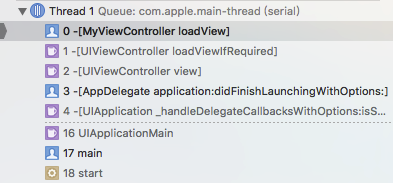

#UIViewController中的loadView、viewDidLoad、viewDidUnload

我们创建的controller中默认有viewDidload方法，在创建自定义UI时也总是在这个方法中写，why?与其相关的loadView以及viewDidUnload方法又是在什么时候调用？

- loadView

 通过调用栈及私有方法重写可以了解loadView方法的调用过程大致是：[UIViewController View]->[UIViewController loadViewIfRequired]->[UIViewController loadView];
<div align="center">

</div>

 由此可以知道loadView的调用时机：当访问UIViewController的view时会调用view的get方法，进而调用loadView。
 那loadView有什么用呢？查看UIViewController的view属性：
 <table><tr><td bgcolor=#7FFFD4>@property(null_resettable, nonatomic,strong) UIView *view; // The getter first invokes [self loadView] if the view hasn't been set yet. Subclasses must call super if they override the setter or getter.
</td></tr></table>
可知loadView的作用：创建UIViewController的view

 默认实现[super loadView]做了些什么呢？
 - 查找UIViewController相关的xib文件创建view
 
   a.有指定xib文件加载指定xib；
   
   b.没有指定xib文件则加载同名xib；
   
   c.没有找到相关xib则创建空白view,所以可不调用父类实现。
   
   ```objc
   // applicationFrame的值是：{{x = 0, y = 20}
   self.view = [[[UIView alloc] initWithFrame:[UIScreen mainScreen].applicationFrame] autorelease];  

   ```
   


- viewDidLoad

 viewDidLoad什么时候会被调用呢？见名思意，view在已经载入的时候调用，来看官方文档的解释：

 <table><tr><td bgcolor=#7FFFD4>Called after the controller'€™s view is loaded into memory.
This method is called after the view controller has loaded its view hierarchy into memory. This method is called regardless of whether the view hierarchy was loaded from a nib file or created programmatically in the loadView method. You usually override this method to perform additional initialization on views that were loaded from nib files.</td></tr></table>

 即viewDidLoad方法在view加载到内存中后就会调用，由上可知是在loadView方法调用后的某个时间，此时view正是在内存中还没有在屏幕上渲染，因此该方法一定早于viewWillAppear方法。一般情况下该方法只会调用一次，但是当出现内存警告，view被unload从内存中清除后会重新调用该方法，或者在不断的创建controller,然后push it again and again。
 作用：做一些初始化工作(添加子视图等)，因为此时view加入内存中可以拿到self.view。