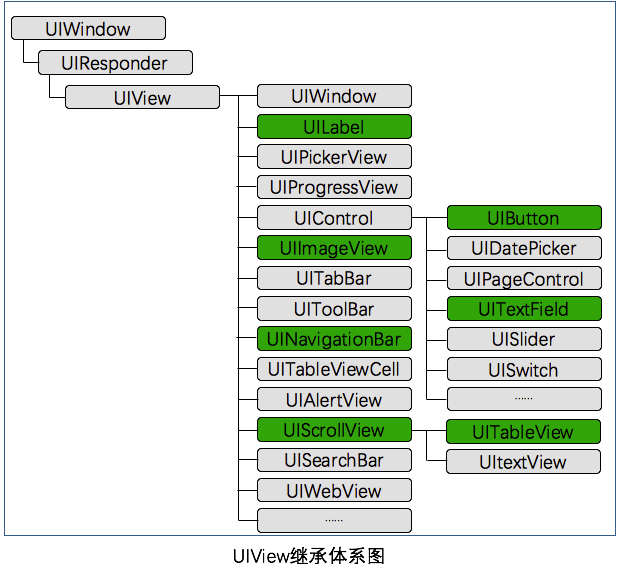
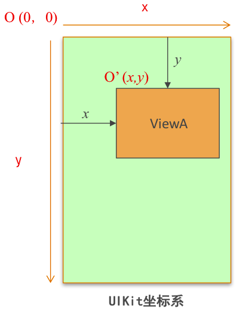
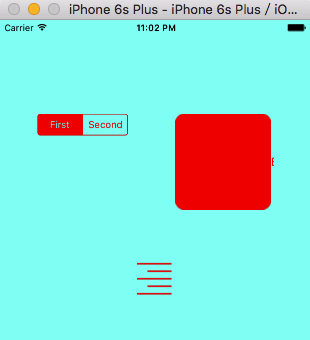

#UIView

作为iOS的初学者，在使用一些基本控件的时候总是遇到一些坑，每次google再google,基本能解决问题，但不免浪费了时间。于是想把控件的常规用法以及需要特别注意的地方记录下来，如有不对之处，还请指正。

###UIView简介

- UIView可称之为控件或视图，是所有控件的父控件。
- 一个app所呈现出来的，看得到的，如图片、文字等都是来自于UIView,如下图所示。
<div align="center">

</div>

- 不难想象，一个视图要呈现出来，必须有位置和大小等属性，所以View提供了各个控件所需的最基本属性和方法。

###UIView属性
- frame属性

frame属性为视图呈现的最基本元素,由位置和大小构成，OC抽象为CGRect这个结构。

```objc
struct CGRect {
    CGPoint origin;
    CGSize size;
};
typedef struct CGRect CGRect;
```
frame属性的基本设置方法：
```objc
UIView *view = [UIView alloc]init];
view.frame = CGRectMake(CGFloat x, CGFloat y, CGFloat width, CGFloat height);

```
我们看到这里用了alloc，再init的方法，即分配内存进而初始化对象，那为什么不直接用new呢？从new方法的原型可以看到alloc方法和new方法几乎没有区别。在原始的OC方法中创建对象一般也是用new方法，
在引入Cocoa等框架后，设计者逐渐明白了不能在一棵树上吊死的理念，才逐步将分配内存和初始化对象分开来，使得初始化有了更多的选择，如常用的initWith方法。
```objc
+ (id) new
{
    return [[self alloc] init];
}
```
差点跑偏，说好的View呢!

UIView通过CGRectMake方法返回一个CGRect,即一个View的坐标原点和大小。在UIKit中，坐标系的原点(0，0)在左上角，x值向右正向延伸，y值向下正向延伸，如下图所示。 
 <div align="center">
      
 </div>


一个view的frame是相对其父类而言的，即view的坐标原点是相对父类view偏离的位置。

- bounds属性

bounds属性和frame属性类似,其主要区别是坐标系的不同，frame以其父类左上角为原点O(0, 0)，如上图ViewA以父类O(0,0)为原点，位置为o'(x,y)。bounds属性以自己为原点，位置坐标为(0,0）。
```objc
frame = a view's location and size using the parent view's coordinate system
  Important for: placing the view in the parent
bounds = a view's location and size using its own coordinate system
  Important for: placing the view's content or subviews within itself
```
- backgroundColor属性

设置背景颜色方法：
点语法或set方法,虽然点语法的实质就是set方法，但某些情况点语法是失效的，需要特别注意。如果希望uivew透明，可以设置其背景色为clearColor，即白色透明度为0的背景色。

```objc
view.backgroundColor = [UIColor redColor];
or [view setBackgroundColor:[UIColor redColor]];
or view.backgroundColor = [UIColor colorWithRed:0.1 green:0.1 blue:0.5 alpha:1];
```
- alpha属性

设置透明度方法：
透明度范围为0-1，0为全透明，1为不透明。

```objc
view.alpha = 0.5;

```

- tintColor属性

tintColor是ios7加入的新属性，有点魔法色的意思，可以重新渲染图片的色彩。如果一个view没有显示的指定tintColor，那它会继承父类的tintColor,如果view层级没有父类则默认为blue color,通过设置keywindow的tintColor就可以设置整个app的主题色。

 
```objc
[[UIApplication sharedApplication] keyWindow].tintColor = [UIColor redColor]; 
``` 
uivew设置tintColor，button类型需为UIButtonTypeSystem，否则无效。
```objc
[self.view setTintColor:[UIColor redColor]];
``` 
效果如下图，可以看到图片线条颜色渲染成了tintColor的红色：
<div align="center">

</div>

tint还有一些值得研究的地方，这里不做细讲，另写一篇笔记以其为主题。

###UIView移动层级方法
相关方法很多，列出常用的几个。
```objc
//添加子view
- (void)addSubview:(UIView *)view;
//插入view在某个view下
- (void)insertSubview:(UIView *)view belowSubview:(UIView *)siblingSubview;
//插入view在某个view上
- (void)insertSubview:(UIView *)view aboveSubview:(UIView *)siblingSubview;
//移动view到最上层
- (void)bringSubviewToFront:(UIView *)view;
``` 

###UIView单击事件

UIView不同于UIButton，UIButton继承于UIControl有addTarget的添加单击事件的方法，UIView添加单击方法可以通过重写UIResponder相关方法和添加手势来实现。

1.UIResponder

UIResponder是专门用来响应用户操作处理各种事件的类。

- 触摸屏幕
 
```objc
- (void)touchesBegan:(NSSet<UITouch *> *)touches withEvent:(UIEvent *)event {
    NSLog(@"touch begin");
}

```
- 在屏幕上移动

```objc
- (void)touchesMoved:(NSSet<UITouch *> *)touches withEvent:(UIEvent *)event {
    //检测touch点是否在targetView上
    UITouch *touch = [touches anyObject];
    CGPoint location = [touch locationInView:self.view];
    if (CGRectContainsPoint(self.targetView, location)) {
        NSLog(@"touch location in the targetView");
    }
}

```
- 手指离开屏幕，触摸结束

```objc
- (void)touchesEnded:(NSSet<UITouch *> *)touches withEvent:(UIEvent *)event {
    NSLog(@"touch end");
}

```

- 系统事件干扰（电话干扰等）

```objc
- (void)touchesCancelled:(NSSet<UITouch *> *)touches withEvent:(UIEvent *)event {
    NSLog(@"touch cancle");
}

```

2.Gesture

UIKit框架提供了UIGestureRecognizer手势识别这个类来对触摸进行处理。
```objc
    //添加单击手势
    UITapGestureRecognizer *tap = [[UITapGestureRecognizer alloc]initWithTarget:self action:@selector(click)];
    [self.view addGestureRecognizer:tap];
```
UIResponder和Gesture在这里都不做深入探讨，在其相应主题再行研究。

第一篇[iOS笔记][1]，大家一起学习。


[1](https://github.com/fengyueran/iOSNote)


