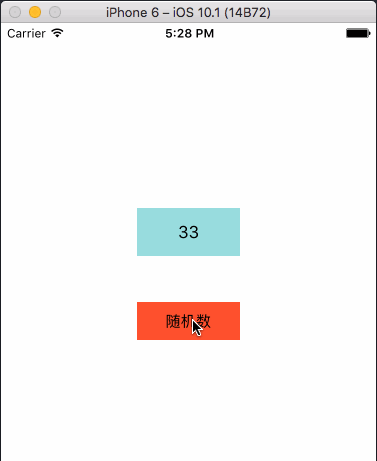

#KVO
KVO即key-value-observing,键值观察，是一种观察者模式的实现机制(另一种为Notification)。KVO提供了一种机制，指定一个被观察对象(如student对象)，当被观察对象student的某个属性(如name)发生改变时观察者对象(如teacher)会收到通知，同时作出相应处理(这孩子，怎么能随便改名呢，把你家长叫来)。

**1.**KVO的应用步骤
- 注册观察者，实施监听:
```objc
    [student addObserver:teacher
              forKeyPath:@"name"
                 options:NSKeyValueObservingOptionNew
                 context:nil];
```
参数说明：

 1）student:被观察者对象
 2）teacher:观察者对象，该对象必须实现    
    observeValueForKeyPath:ofObject:change:context: 方法
 3）forKeyPath:被观察者的属性名，必须和被观察者属性名相同
 4）options:属性配置，有四个值：
 ```objc
 typedef NS_OPTIONS(NSUInteger, NSKeyValueObservingOptions) {
 //接收方法中传入属性变化后的新值，键为NSKeyValueChangeNewKey
    NSKeyValueObservingOptionNew = 0x01,
    //接收方法中传入属性变化前的旧值，键为NSKeyValueChangeOldKey
    NSKeyValueObservingOptionOld = 0x02,
    //注册之后会立刻调用接收方法，可以在程序第一次运行时做一些初始化操作，
    如果配置了NSKeyValueObservingOptionNew，change参数内容会包含新值
    NSKeyValueObservingOptionInitial NS_ENUM_AVAILABLE(10_5, 2_0) = 0x04,
    //接收方法会在属性变化前后分别调用一次，变化前的通知change参数包含键值对：notificationIsPrior = 1。
    NSKeyValueObservingOptionPrior NS_ENUM_AVAILABLE(10_5, 2_0) = 0x08
 }
 ```
 5）context:接收一个C指针，可以为kvo的回调方法传值。

- 在回调方法处理属性变化
每当监听的keypath发生改变就会调用该方法：

 ```objc
 - (void)observeValueForKeyPath:(NSString *)keyPath ofObject:(id)object change:(NSDictionary<NSKeyValueChangeKey,id> *)change context:(void *)context {
    if (context ==  &PrivateKVOContext) {
        if ([keyPath isEqualToString:@"name"]) {
            NSString *oldName = change[NSKeyValueChangeOldKey];
            NSString *newName = change[NSKeyValueChangeNewKey];
        }
    }
}
```
参数说明：
1）keyPath：被监听的keyPath , 用来区分不同的KVO监听；
2）object：被观察对象，可以获得修改后的属性值；
3）change：保存信息改变的字典（可能有旧的值，新的值等）
```objc
默认change参数会包含一个NSKeyValueChangeKindKey键值对，传递被监听属性的变化类型：
enum {
//属性被重新设置
NSKeyValueChangeSetting = 1,
//表示更改的是集合属性，分别代表插入、删除、替换操作
NSKeyValueChangeInsertion = 2,
NSKeyValueChangeRemoval = 3,
NSKeyValueChangeReplacement = 4
};
typedef NSUInteger NSKeyValueChange;

 ```
  如果NSKeyValueChangeKindKey参数是针对集合属性的三个之一，change  参数还会包含一个NSKeyValueChangeIndexesKey键值对，表示变化的index。
  

4）context：上下文，可以用来区分不同的KVO监听。

- 移除观察者
观察者一定要在适当的时候将其移除。
```objc
[student removeObserver:teacher forKeyPath:@"name" context:&PrivateKVOContext];
```

**2.**KVO的简单应用实例
KVO的常用场景是在MVC中同步model和UI，实现这样的需求：点击view的时候更新model的(person)数据并触发UI同步。可以看到应用KVO轻松的监听到模型数据的变化，进而在回调中更新UI。

<div align="center">

</div>

 ```objc
@interface ViewController ()
- (IBAction)randomAge:(UIButton *)sender;
@property (weak, nonatomic) IBOutlet UILabel  *ageLabel;
@property (strong, nonatomic) Person *person;
@end

 @implementation ViewController

- (void)viewDidLoad {
    [super viewDidLoad];
    self.person = [[Person alloc]init];
    //创建观察者
    [self.person addObserver:self
              forKeyPath:@"myAge"
                 options:NSKeyValueObservingOptionNew
                 context:nil];

 }
 
- (void)observeValueForKeyPath:(NSString *)keyPath ofObject:(id)object change:(NSDictionary<NSKeyValueChangeKey,id> *)change context:(void *)context {
    //UI同步
    self.ageLabel.text = [NSString stringWithFormat:@"%@",change[NSKeyValueChangeNewKey]];
}

- (IBAction)randomAge:(UIButton *)sender {
    //更新model数据
    self.person.myAge = arc4random() % 100 ;
}

- (void)dealloc {
    //移除观察者
    [self removeObserver:self forKeyPath:@"myAge"];
}
 
 @end
 ```

**3.**手动键值观察
在以上KVO的应用中通过创建观察者，在属性变化时就会自动发出通知，而有些场景需要人为的控制通知的发送，这需要重写被观察者对象属性的getter/setter方法。

```objc
#import "Person.h"

@implementation Person
{
   NSUInteger myAge;
}

- (NSUInteger)myAge {
    return myAge;
}

- (void)setMyAge:(NSUInteger)newAge {
    //发送通知：键值即将改变
    [self willChangeValueForKey:@"myAge"];
    myAge = newAge;
    //发送通知：键值已经修改
    [self didChangeValueForKey:@"myAge"];
}

//当设置键值之后，通过此方法，决定是否发送通知
+ (BOOL)automaticallyNotifiesObserversForKey:(NSString *)key {
    //当key为myAge时，手动发送通知
    if ([key isEqualToString:@"myAge"]) {
        return NO;
    }
    //当为其他key时，自动发送通知
    return YES;
}

@end
```

**4.**设置属性之间的依赖

假设我要监听一个color属性的变化，而一个color又与三原色相关，每种原色又由不同的组分构成，如此我们就需要监听N个原色属性的变化，每个原色属性变化就去设置color的值，我的天，太麻烦了，事情总是有解决的办法：KVO给我们提供了这种键之间的依赖方法
```objc
+ (NSSet *)keyPathsForValuesAffecting<Key>;
```
```objc
//设置属性依赖，属性greenComponent，依赖于属性lComponent和属性aComponent
+ (NSSet *)keyPathsForValuesAffectingGreenComponent {
    return [NSSet setWithObjects:@"lComponent", @"aComponent",nil];
}

+ (NSSet *)keyPathsForValuesAffectingRedComponent {
    return [NSSet setWithObject:@"lComponent"];
}

+ (NSSet *)keyPathsForValuesAffectingBlueComponent {
    return [NSSet setWithObjects:@"lComponent", @"bComponent", nil];
}

+ (NSSet *)keyPathsForValuesAffectingColor {
    return [NSSet setWithObjects:@"redComponent", @"greenComponent",@"blueComponent", nil];
}

```
通过color的属性依赖设置，在原色组分lComponent、aComponent、bComponent发生变化时观察者仍能收到color变化的通知。

**5.**KVO机制
前面已经了解到KVO的基本用法，那么KVO底层是如何实现的呢？Let me think，既然KVO能够监听属性的变化，那么在被观察者属性的set方法中判断如果属性值发生了变化就向观察者发送通知就可以实现，似乎很简单，但事实是KVO并没有对被观察者进行显示地修改，那要如何监听到被观察者的属性改变呢？


