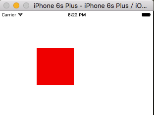
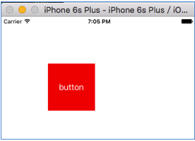
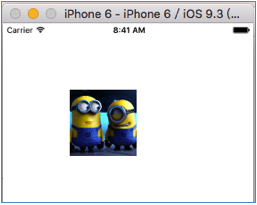
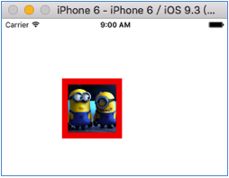

#UIButton
UIButton作为最常用的控件之一，其继承了父类UIView的属性和方法，同时由于其继承了UIControl使其与UIView区别开来，可以接收touch事件。

##UIButton常用方法

- UIButton的创建

```objc
UIButton *button = [[UIButton alloc]initWithFrame:CGRectMake(100, 100, 100, 100)];
button.titleLabel.text = @"button";
button.backgroundColor = [UIColor redColor];
[self.view addSubview:button];
    
```
效果如下图，可以看到button的title并没有显示出来,why?
<div align="center">

</div>


于是默默的打印了button...
```objc
<UIButtonLabel: 0x7fccf9725290; frame = (0 0; 0 0);
 text = 'button'; hidden = YES; opaque = NO; userInteractionEnabled = NO; 
 layer = <_UILabelLayer: 0x7fccf97258e0>>
```
可以看到直接用点语法设置title时button上的label frame为0，且hidden属性为YES，title自然不能显示，需要改用set方法进行设置。
```objc
UIButton *button = [[UIButton alloc]initWithFrame:CGRectMake(100, 100, 100, 100)];
[button setTitle:@"button" forState:UIControlStateNormal];
button.backgroundColor = [UIColor redColor];
[self.view addSubview:button];
```
效果如下图，可以看到button的title显示出来了。
<div align="center">

</div>

此时button上的label为：
```objc
<UIButtonLabel: 0x7fc90243b660; frame = (50 50; 0 0); 
text = 'button'; opaque = NO; 
userInteractionEnabled = NO;
layer = <_UILabelLayer: 0x7fc90243bcb0>>

```

- 设置按钮图片

首先我尝试了这样的方法：
```objc
button.imageView.image = [UIImage imageNamed:@"minion"];
```
很遗憾，图片并未显示，于是很自然的改用set方法
```objc
[button setImage:[UIImage imageNamed:@"minion"] forState:UIControlStateNormal];
```
效果如下图，button的图片显示出来了，而且图片缩放到了button的大小。

<div align="center">

</div>


- 设置按钮图片边距

很多时候并不想图片直接占满整个button，而是希望在上下左右留出一定边距。这需要用到imageEdgeInsets属性：
```objc
 button.imageEdgeInsets = UIEdgeInsetsMake(10, 10, 10, 10);
```
效果如下图，button图片上左下右的边距都设置成了10，当然如果是背景图则无效。
<div align="center">

</div>


