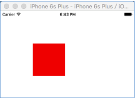

#UIButton
UIButton作为最常用的控件之一，其继承了父类UIView的属性和方法，同时由于其继承了UIControl使其与UIView区别开来，可以接收touch事件。

##UIButton常用方法

1）UIButton的创建

```objc
UIButton *button = [[UIButton alloc]initWithFrame:CGRectMake(100, 100, 100, 100)];
button.titleLabel.text = @"button";
button.backgroundColor = [UIColor redColor];
[self.view addSubview:button];
    
```
效果如下图，可以看到button的title并没有显示出来,why?
<div align="center">

</div>


于是默默的打印了button...
```objc
<UIButtonLabel: 0x7fccf9725290; frame = (0 0; 0 0);
 text = 'button'; hidden = YES; opaque = NO; userInteractionEnabled = NO; 
 layer = <_UILabelLayer: 0x7fccf97258e0>>
```
可以看到直接用点语法设置title时button上的label frame为0，且hidden属性为YES，title自然不能显示，需要改用set方法进行设置。
```objc
UIButton *button = [[UIButton alloc]initWithFrame:CGRectMake(100, 100, 100, 100)];
[button setTitle:@"button" forState:UIControlStateNormal];
button.backgroundColor = [UIColor redColor];
[self.view addSubview:button];
```
效果如下图，可以看到button的title显示出来了。
<div align="center">

</div>

此时button上的label为：
```objc
<UIButtonLabel: 0x7fc90243b660; frame = (50 50; 0 0); 
text = 'button'; opaque = NO; 
userInteractionEnabled = NO;
layer = <_UILabelLayer: 0x7fc90243bcb0>>

```

2）设置按钮图片

首先我尝试了这样的方法：
```objc
button.imageView.image = [UIImage imageNamed:@"minion"];
```
很遗憾，图片并未显示，于是很自然的改用set方法
```objc
[button setImage:[UIImage imageNamed:@"minion"] forState:UIControlStateNormal];
```
效果如下图，button的图片显示出来了，而且图片缩放到了button的大小。

<div align="center">

</div>


3）设置按钮图片边距

很多时候并不想图片直接占满整个button，而是希望在上下左右留出一定边距。这需要用到imageEdgeInsets属性：
```objc
 button.imageEdgeInsets = UIEdgeInsetsMake(10, 10, 10, 10);
```
效果如下图，button图片上左下右的边距都设置成了10，当然如果是背景图则无效。
<div align="center">

</div>

4）button的几个状态

- UIControlStateNormal

 正常状态，默认状态，既不是selected状态也不是高亮状态的一个状态。
 
- UIControlStateHighlighted

 高亮状态，即按钮被点击且手还未离开按钮的一个状态。

- UIControlStateSelected
 选中状态，不是字面上理解的按钮被点击选中，可以理解为与高亮和正常状态不同的一种状态，可以通过改变其selected属性来改变这个状态。
 
- UIControlStateDisabled
 不可用状态，即按钮此时处于灰色不能响应点击的状态。


我们时常有这样一个需求：当点击某个按钮时改变其显示的图片，当再点击时又变回原来的图片。这就可以通过改变按钮的正常状态和选中状态切换来实现。

```objc
- (void)viewDidLoad {
    [super viewDidLoad];
    [self.btn setImage:[UIImage imageNamed:@"duck"] forState:UIControlStateNormal];
    [self.btn setImage:[UIImage imageNamed:@"pinguin"] forState:UIControlStateSelected];
}
      
- (IBAction)click:(UIButton *)sender {
    sender.selected = !sender.selected;
}
```


从上面的动图可以看到每次点击,图片切换了，但是当点击按钮且离开按钮前显示了图片默认的高亮状态图，感觉有些突兀想直接切换不要显示高亮状态的图片。有没有什么方法可以使状态切换由normal->highlighted->selected跳过highlighted变为normal->selected呢？那就把正常状态到高亮设置成一样，把选中状态到高亮状态的图片设置成一样不就没有突变了么。

```objc
- (void)viewDidLoad {
    [super viewDidLoad];
    [self.btn setImage:[UIImage imageNamed:@"duck"] forState:UIControlStateHighlighted];
    [self.btn setImage:[UIImage imageNamed:@"duck"] forState:UIControlStateNormal];
    [self.btn setImage:[UIImage imageNamed:@"pinguin"] forState:UIControlStateSelected];
    //选中状态下的高亮图片
    [self.btn setImage:[UIImage imageNamed:@"pinguin"] forState:UIControlStateSelected|UIControlStateHighlighted];
}
```

可以看到由normal->highlighted的高亮状态还在，太恶心了，看来只有在子类重写button的setHighted来屏蔽系统高亮方法了。其实最简单做法是让button的类型Type由System改为Custom。效果如下：状态切换一点也不闹心了，不过系统的东西都没了，tintColor什么的都没用了。

